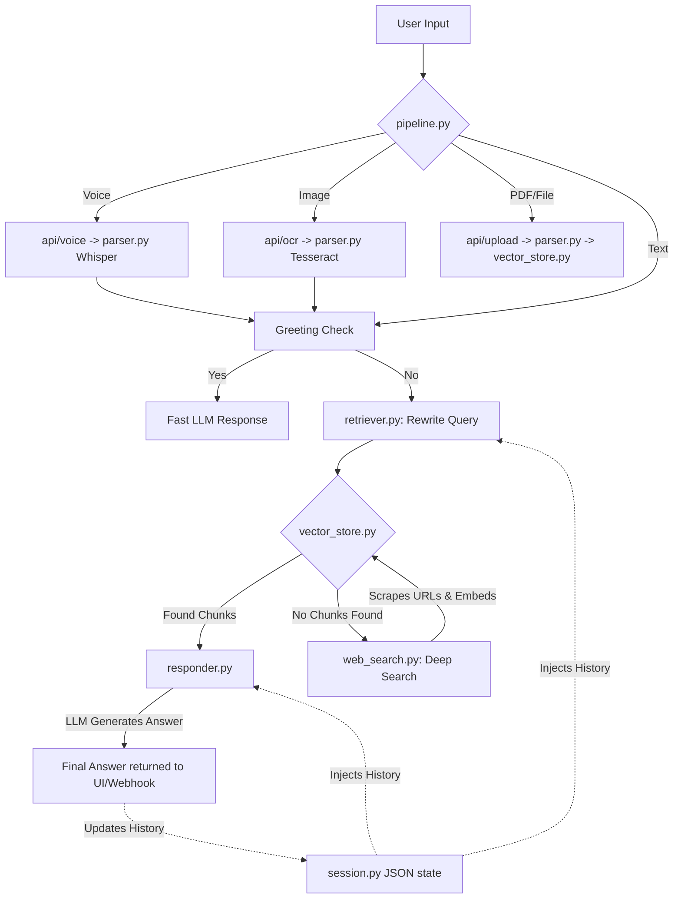

# 🧠 Universal Web Scraper & API with Hybrid RAG

A heavily simplified, state-of-the-art AI architecture that ingests text, images, voice, PDFs, and scraped web content into exactly **15 python files**. This project provides a universal brain via a flexible REST API and a robust Streamlit UI, allowing deployment across WhatsApp, Telegram, Instagram, and web applications natively.

---

## 🚀 How to Clone and Run

1. **Clone the repository:**
   ```bash
   git clone https://github.com/your-username/universal-web-scraper.kr
   cd universal-web-scraper
   ```
2. **Create and activate a virtual environment:**
   ```bash
   # Windows
   python -m venv venv
   .\venv\Scripts\activate
   
   # Mac/Linux
   python3 -m venv venv
   source venv/bin/activate
   ```
3. **Install dependencies:**
   ```bash
   pip install -r requirements.txt
   ```
4. **Set up your environment variables:**
   - Copy the `.env.example` file located in the `config/` directory.
   - Rename it to `.env` (so the path is `config/.env`).
   - Add your `GROQ_API_KEY` and Qdrant details inside.
5. **Run the system:**
   ```bash
   python run.py
   ```
   This command starts the FastAPI server on `http://localhost:8000` and the Streamlit UI on `http://localhost:8501`.

---

## 🏗️ Project Structure (15 Files)

The entire architecture has been stripped down to exactly 15 cleanly organized files across 4 folders:

```text
src/
├── ingestion/
│   ├── __init__.py      # Marks folder as a python module.
│   ├── parser.py        # ALL input parsing combined: PDF, Word, Excel, PPT, Tesseract OCR, Groq Whisper Audio.
│   └── chunker.py       # Cleans whitespace/artifacts and splits text into 500-word chunks.
├── storage/
│   ├── __init__.py      # Marks folder as a python module.
│   ├── session.py       # Manages persistent chat history & document summaries per user via a flat JSON file.
│   └── vector_store.py  # All Qdrant DB vector storage logic + inline SentenceTransformer embedding.
├── agent/
│   ├── __init__.py      # Marks folder as a python module.
│   ├── pipeline.py      # Main entry point (RAGAgent); checks if intent is a greeting, RAG, or Web Search.
│   ├── retriever.py     # Rewrites user queries for better search context and fetches vector chunks.
│   ├── web_search.py    # Performs DuckDuckGo searches, scrapes HTML with BeautifulSoup, and embeds results.
│   └── responder.py     # Takes chunks and history, sends them to the Groq LLM, and generates cited answers.
├── api/
│   ├── __init__.py      # Marks folder as a python module.
│   ├── server.py        # All FastAPI endpoints (/ask, /upload, /voice, /ocr, /health).
│   ├── webhook.py       # The universal endpoint (/api/webhook/universal) that connects to WhatsApp/Telegram.
│   └── ui.py            # The entire Streamlit chat interface (with inline CSS).
└── config.py            # Loads all .env variables and raises errors if missing.

run.py                   # Root launcher using subprocess to boot API and Streamlit simultaneously.
```

---

## ⚙️ Pipeline Architecture

The pipeline operates in a highly sequential, state-driven manner. Here is the visual flow:



### Detailed Steps:

1. **Intent & State Verification (`pipeline.py`)**: When a query enters `RAGAgent.ask()`, it first performs a lightweight LLM check to see if the user is simply saying "Hello". If yes, it responds instantly to save tokens.
2. **Query Expansion (`retriever.py`)**: If the user asks a complex question, the query is rewritten based on their prior conversation history to form an optimized semantic search query.
3. **Retrieval**: The system searches the **Qdrant Vector Database** (`vector_store.py`) to find relevant text chunks.
4. **Fallback Web Search (`web_search.py`)**: If the database doesn't have the answer (or if chunks are insufficient), the pipeline falls back to DuckDuckGo, fetches the live URLs, parses the HTML into Markdown, embeds the new knowledge into Qdrant in real-time, and searches again.
5. **Synthesis (`responder.py`)**: The conversation history and all relevant chunks are packaged together as context and passed to the Groq LLM to synthesize a final, highly accurate answer with source citations.

---

## 🔗 Using the FastAPI & Webhooks

### 1. Webhook Endpoint for Integrations
If you want to connect this AI to **Telegram, Twilio (WhatsApp), Instagram**, or Make.com, you must point their webhook URL to:
```text
POST http://YOUR_SERVER_IP:8000/api/webhook/universal
```
**How it works:** The `webhook.py` endpoint dynamically parses incoming JSON payloads. It auto-detects if the request came from Telegram or WhatsApp, extracts the `session_id` (the user's phone number or chat ID) and their `message`, and feeds it into the pipeline.

### 2. How the API Handles Multimodal Inputs (Voice, Image, PDF)
The API manages modalities **differently** based on explicit routes to keep the pipeline completely uniform internally:
- **Files/PDFs:** Sent via `POST /api/upload`. The API hands the file to `parser.py`, which returns text. It embeds the text into the user's vector space.
- **Voice Memos:** Sent via `POST /api/voice`. The API routes the raw `.wav/.mp3` bytes to `parser.py` (which uses Groq Whisper). The resulting transcription is passed to the AI as a normal text prompt.
- **Images/Photos:** Sent via `POST /api/ocr`. The API routes the image to Tesseract OCR to extract the text, which is then fed into the AI as a normal text prompt.
**Result:** By the time any data actually hits the internal `agent/pipeline.py`, it has already been normalized into pure text strings. The LLM only ever deals with clean text, making the architecture incredibly stable.

---

## 🧠 Memory Handling (State Management)

In previous, highly complex architectures, memory is often handled using heavy dependencies like **LangChain** and **LangGraph** to pass conversational "state" back and forth between nodes. 

To achieve the **15-file simplified architecture**, we emulate LangGraph's State dictionaries using a much lighter approach in `src/storage/session.py`. 
- **The State Context**: Every time a user interacts, their unique `session_id` pulls a state dictionary (containing `history` and `doc_summaries`) from a flat JSON file.
- **Passing the State**: Instead of a LangGraph node passing the state forward, our `pipeline.py` fetches the history state and injects it manually into `retriever.py` (for context-aware query rewriting) and `responder.py` (so the LLM remembers previous messages). 
- **Updating the State**: After the LLM generates a response, the new interaction is appended to the JSON dictionary. This mimics the cyclic memory features of LangChain without requiring the massive library overhead, keeping the code simple and bug-free.
