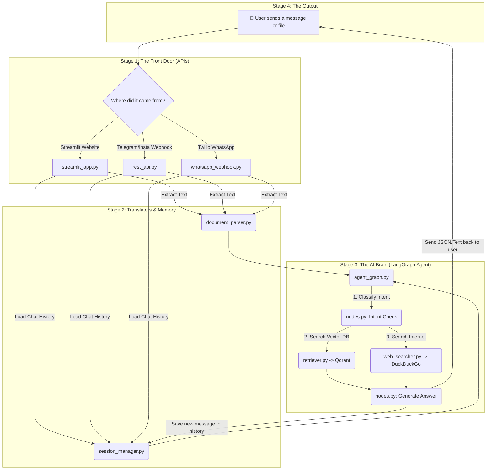

# 🧠 Universal Web Scraper & API with Hybrid RAG

A state-of-the-art, multi-modal AI architecture that ingests text, images, voice, PDFs, and scraped web content. This project provides a universal brain via a flexible REST API and a robust Streamlit UI, allowing deployment across WhatsApp, Telegram, Instagram, and web applications natively.

---

## ✨ Core Features

| Feature | Description |
|---|---|
| 🌍 **Universal Webhook API** | Exposes a single `/api/webhook/universal` endpoint that magically auto-detects and answers payloads from **Telegram, Instagram, Twilio (WhatsApp), Zapier, or Make.com**. |
| 🗄️ **Omnichannel Memory** | A centralized `session_manager` ensures that if a user starts a conversation on WhatsApp and finishes it on the web UI, the AI remembers perfectly. |
| 📄 **Universal File Parser** | `document_parser.py` seamlessly handles PDF, Word, Excel, CSV, PPT, and plain text uploads identically across both the API and Streamlit UI. |
| 🎙️ **Voice & 🖼️ Image** | Natively transcribes audio (Groq Whisper) and extracts text from images (Tesseract OCR). |
| 🤖 **Multi-Model Hot Swapping** | Dynamically hot-swap between Groq, Gemini, OpenAI, and Anthropic in real-time. |
| 🌐 **Autonomous Web Scraping** | The Agent recognizes knowledge gaps, searches the internet via DuckDuckGo, scrapes the HTML, embeds it into Qdrant, and returns factual answers. |

---

## 🏗️ Detailed Pipeline Architecture

Our system is broken down into four distinct stages that process a user's request from the moment it hits the server to the final response.


### 1. 📥 The Front Door (Ingress & APIs)
When a user sends a message, file, or voice note, it hits one of our APIs:
- **Streamlit UI:** The visual chat interface.
- **REST API (`/api/ask`):** A standard JSON endpoint for custom software.
- **Universal Webhook (`/api/webhook/universal`):** Auto-detects payloads from Telegram, Instagram, Twilio, and Zapier, extracts the user ID, and passes it forward.

### 2. 🔀 The Translators (Parsing & Memory)
The AI only understands text, so we have to convert the raw inputs:
- **`document_parser.py`:** If the input is a PDF, Excel, Word document, or image, this file extracts the raw text. If it is an audio file, it uses Groq Whisper to transcribe it.
- **`session_manager.py`:** At the exact same time, this file looks up the user's ID to fetch their previous chat history so the AI remembers the conversation context.

### 3. 📚 The Librarian (Vectorization & Qdrant)
If the user uploaded a massive document, we can't feed it all to the AI at once.
- **`chunker.py`:** Cuts the extracted text into bite-sized 500-word paragraphs.
- **`embedder.py`:** Converts those paragraphs into numbers (vectors).
- **`vector_store.py`:** Saves those vectors securely into Qdrant (our Vector Database), explicitly tagged with the user's `session_id` to ensure absolute data privacy.

### 4. 🧠 The Brain (LangGraph Agent Orchestrator)
Finally, the text and chat history reach the AI core (`agent_graph.py`):
1. **Intent Classification:** The AI looks at the prompt and decides if it needs to search the uploaded document, search the live internet, or just have a normal conversation.
2. **Retrieval:** It asks Qdrant for the most relevant "chunks" of text related to the question.
3. **Web Fallback (`web_searcher.py`):** If Qdrant doesn't have the answer, the AI autonomously opens DuckDuckGo, scrapes 3 websites, and learns the answer on the fly.
4. **Synthesis:** The AI fuses the retrieved data with the chat history, generates a final factual response, saves the new memory back to the `session_manager`, and sends the answer back out the Front Door to the user.

---

## 📁 Modular Project Structure & File Understandings

```
universal-web-scraper/
├── src/
│   ├── core/                     # Data processing & extraction
│   │   ├── document_parser.py    # Universal doc extraction (Rips text from PDF, Excel, Word, OCR, Audio)
│   │   ├── scraper.py            # Fetches raw HTML from URLs and cleanly converts it to Markdown
│   │   ├── cleaner.py            # Normalizes text by removing excessive whitespace and unicode artifacts
│   │   ├── chunker.py            # Splits massive documents into smaller, semantic 500-word blocks
│   │   ├── embedder.py           # Transforms text chunks into mathematical vectors using MiniLM
│   │   └── contact_extractor.py  # Hybrid extraction for specialized contact/lead identification
│   ├── database/                 # Data persistence & state management
│   │   ├── session_manager.py    # Centralized persistent JSON chat memory mapped by session_id
│   │   ├── metadata_registry.py  # Generates and stores quick AI summaries/profiles of uploaded documents
│   │   └── vector_store.py       # Handles all read/write/delete operations with the Qdrant database
│   ├── api/                      # Ingress Endpoints
│   │   ├── rest_api.py           # Universal FastAPI backend hosting /api/ask and the Universal Webhook
│   │   ├── streamlit_app.py      # The primary ChatGPT-style visual web interface
│   │   └── whatsapp_webhook.py   # Legacy endpoint specifically formatted to handle Twilio's XML requirements
│   ├── ui/                       # UI Rendering Modules
│   │   ├── renderers.py          # Streamlit helper functions to draw confidence bars, sources, and fact checks
│   │   └── styles.py             # Global CSS abstraction to keep the Streamlit app clean and premium
│   ├── agents/                   # LangGraph AI Agent Logic
│   │   ├── agent_graph.py        # The central orchestrator that routes data between all sub-agents
│   │   ├── intent_classifier.py  # Determines if the user wants to chat, search docs, or search the web
│   │   ├── query_generator.py    # Rewrites user questions into optimized search queries for the database
│   │   ├── retriever.py          # The logic that actually fetches the vector chunks from Qdrant
│   │   ├── web_searcher.py       # Autonomously triggers DuckDuckGo, scrapes links, and embeds new knowledge
│   │   ├── response_generator.py # Synthesizes the final answer using retrieved context and chat history
│   │   ├── fact_verifier.py      # Double-checks the AI's final answer against the source documents for hallucinations
│   │   └── sentiment_adapter.py  # Adjusts the AI's tone based on the user's emotional state
│   └── utils/
│       ├── indexer.py            # Batch processing script for indexing massive directories of local files
│       └── assets.py             # Global constants, avatars, and application descriptions
├── config/                       # Settings & API keys
│   ├── .env.example              # Template for environment variables
│   └── settings.py               # Loads environment variables into Python safely
├── requirements.txt              # Core Python dependencies (FastAPI, Streamlit, LangGraph, etc)
├── run_all.py                    # A master startup script that runs both the FastAPI and Streamlit servers
└── README.md                     # You are reading it right now!
```

---

## 🚀 Quick Start

### 1. Clone & Install Environment

```bash
git clone <repo-url>
cd universal-web-scraper
python -m venv venv
venv\Scripts\activate          # Windows
# source venv/bin/activate     # macOS/Linux
pip install -r requirements.txt
```

### 2. Configure Environment (`config/.env`)

Copy the example environment file:
```bash
copy config\.env.example config\.env
```

Ensure your `config/.env` contains your active keys:
```env
# Required for core LLM routing
GROQ_API_KEY=gsk_your_groq_api_key

# Required for Universal Models (Gemini routing)
GOOGLE_API_KEY=AIza_your_google_key

# Required for Persistent Vector Storage (Cloud)
QDRANT_URL=https://your-qdrant-cluster.cloud.qdrant.io
QDRANT_API_KEY=your_qdrant_key
```

### 3. Run the Omnichannel System

The easiest way to start both the Universal REST API (FastAPI) and the Streamlit UI simultaneously:

```bash
python run_all.py
```
- **Streamlit Web UI:** `http://localhost:8501`
- **FastAPI Backend:** `http://localhost:8000`
- **API Documentation:** `http://localhost:8000/docs`

---

## 🌐 How to Use the Universal Webhook

If you are connecting this AI to **Telegram, Instagram, Twilio**, or standard webhooks, point your app to:
`POST http://<your-server-ip>:8000/api/webhook/universal`

The webhook automatically parses:
- `application/x-www-form-urlencoded` (Twilio WhatsApp)
- `application/json` containing Telegram Webhook format (`message.chat.id`)
- `application/json` containing Facebook/Instagram format (`entry.messaging.sender.id`)
- Standard `application/json` (`{"session_id": "123", "message": "hello"}`)

You no longer need specific endpoint mapping for standard integrations.

---

## 🔒 Security & Privacy

- **Memory Isolation:** The `session_manager` rigorously namespaces memory by `session_id` to ensure users never access another user's chat history.
- **Vector Isolation:** Qdrant payloads explicitly attach a unique `site_name` tag prefixing the user's `session_id`, sandboxing knowledge bases.
- **Stateless Agent:** The underlying LangGraph agent is ephemeral and only reconstructs history dynamically on invocation. 

---

## 📄 License
MIT
